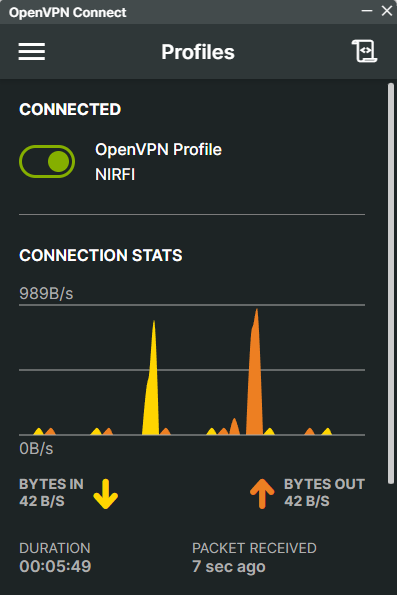
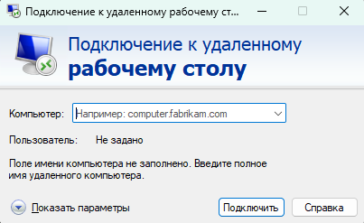
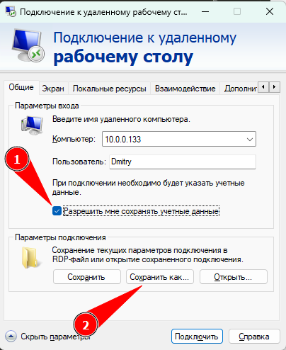
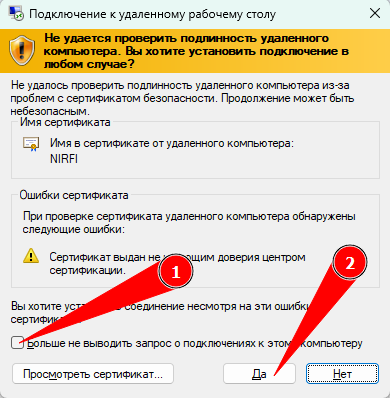
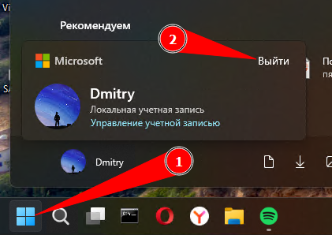

# Подключение к серверу НИРФИ

## 0. Терминология и нюансы

- **Сервер** - компьютер, находящийся в НИРФИ
- **Клиент** - компьютер пользователя, подключающийся к серверу удаленно
- **VPN** - виртуальная локальная сеть. Для того, чтобы иметь доступ к серверу, нужно быть как бы рядом с ним, в одной сети. Поэтому без подключения к этой сети ничего не выйдет. При проблемах с подключением в первую очередь проверяйте наличие активного VPN соединения
- **OpenVPN** - opensourse реализация VPN-сети. В нашем случае - ключ (в единственном экземпляре, т.е. на одно соединение) предоставляется А.А. Шиндиным
- **ZeroTier One (ZT)** - проприетарная технология реализации VPN-сети, однако одна из немногих (если не единственная), пробивающая защиту фаервола университета. Позволяет подключать до 10 устройств в одну сеть

Список существующих в системах учетных записей:
  - ```Sergey```
  - ```Dmitry```
  - ```vfmeln```
  - ```rinbak```
  - ```4sunshine```

#### **Важно!**

**Следует по возможности использовать подключение с помощью ZeroTier**, так как он не ограничивает количество одновременно подключенных пользователей. В случае, если подключение через ZeroTier не проходит (такое иногда бывает, например, при работе от мобильной сети) - уже переходить на OpenVPN.

На текущий момент у нас имеется только один ключ доступа к OpenVPN, поэтому после окончания работ необходимо отключать клиент от OpenVPN - иначе другой пользователь не сможет произвести подключение.

**Linux является ведущей ОС**, так как из нее можно удобно перезагрузиться в Windows, а вот наоборот - нет. По умолчанию **при включении/перезагрузке сервера всегда будет запускаться Linux**.

Для перезагрузки *из Linux в Windows* используйте команду ```sudo grub2-reboot 4 && sudo reboot```
<font size="2">(*4 - номер загрузочной записи в GRUB. Теоретически, он может измениться, например, после обновления системы или удаления старых ядер ОС. Практически - такого не происходило еще ни разу)*</font>

Для перезагрузки *из Windows в Linux* достаточно обычной перезагрузки системы

По всем вопросам, чтобы узнать пароль учетных записей обращаться [сюда] (https://t.me/astronom_v_cube)

Для удобного мониторинга состояния сервера и для получения ключа доступа к VPN существует [TG-бот](https://t.me/nirfi_server_bot)

## 1. Установка Zerotier One

Подробно об установке ZT на все виды ОС читать на официальном [сайте] (https://www.zerotier.com/download/).

```9e1948db634eafb7``` - идентификационный номер нашей НИРФИ-сети.

### 1.1. Установка в Linux (Debian, Ubuntu, CentOS, RHEL, Fedora)

Последовательно выполнить в терминале три команды:

```curl -s 'https://raw.githubusercontent.com/zerotier/ZeroTierOne/main/doc/ contact%40zerotier.com.gpg' | gpg --import```

```if z=$(curl -s 'https://install.zerotier.com/' | gpg); then echo "$z" | sudo bash; fi```

```sudo zerotier-cli join 9e1948db634eafb7```

### 1.2. Установка в Windows

Воспользуйтесь [установочным файлом] (https://download.zerotier.com/dist/ZeroTier%20One.msi).

После установки зайдите в настройки и укажите номер сети (`9e1948db634eafb7`).

### 1.3. Выдача разрешения на доступ в сеть устройству

После установка необходимо дать доступ устройству в сеть в личном кабинете: нужно зайти на сайт [ZT] (https://my.zerotier.com/auth) с помощью (т.е. *"sign in with"*) учетной записи МЦСР в Google (*`mcsr.unn@gmail.com`*). После авторизации зайти в сеть с названием NIRFI и установить для появившегося устройства галочку ```Authorized```. В случае, если устройство не появилось, можно добавить его вручную: для этого нужно узнать идентификационный номер конкретного устройства и воспользоваться полем ```Manually Add Member```.

## 2.  Установка OpenVPN Connect

### 2.1. Установка в Windows

Загрузка установочного файла по этой [ссылке] (https://openvpn.net/downloads/openvpn-connect-v3-windows.msi) напрямую, или на официальном [сайте] (https://openvpn.net/client/client-connect-vpn-for-windows/) (также доступна х32 версия).
Установка - как обычно.

### 2.2. Установка в Linux

OpenVPN установлен в большинстве систем Linux по умолчанию. Если возникли проблемы, установку для вашей конкретной системы можно найти [здесь] (https://openvpn.net/cloud-docs/tutorials/configuration-tutorials/connectors/operating-systems/linux/tutorial--learn-to-install-and-control-the-openvpn-3-client.html)

## 2. Добавление ключевого файла

### 2.1. Добавление в Windows

- Получите сам ключевой файл
- Запускаем OpenVPN Connect
- Переключаемся на вкладку ```upload file```
- Перетаскиваем ключевой файл в окно
- Нажимаем оранжевую кнопку ```connect```
- В случае удачного подключения - появится надпись ```connected``` и статистика переданных данных

В дальнейшем подключение и отключение VPN регулируется переключателем рядом с именем профиля



Для того, чтобы активировать мониторинг занятости VPN через бота, необходимо в терминале PowerShell (!) Windows, запущенном от имени администратора, выполнить команду ```Set-NetFirewallRule -Name CoreNet-Diag-ICMP4-EchoRequest-In -enabled True```. После этого другие пользователи смогут увидеть, занят ли VPN вами, или нет

### 2.2. Добавление в Linux

*тестируется*

## 3. Подключение к серверу - Linux


### 3.1. Подключение по SSH

- Запустить терминал (в Windows нажатием на ПКМ на пуск -> командная строка, или сочетанием клавиш Win+R, ввод ```cmd``` и далее - выполнить)
- Использовать команду ```ssh $USER$@10.0.0.133```, где вместо ```$USER$``` ввести логин своего пользователя на сервере
  - При первом подключении в ответ на вопрос о подключении ввести ```yes```
  - Ввести пароль учетной записи

### 3.2. Подключение по ....

## 4. Подключение к серверу Windows

### 4.1. Подключение по SSH

Действия аналогичны действиям в Linux, однако обратите внимание на пароли, они могут не совпадать. Также есть определенный нюанс.

При попытке подключения скорее всего выйдет ошибка ```WARNING: REMOTE HOST IDENTIFICATION HAS CHANGED!```
Для разового подключения можно выполнить команду ```ssh-keygen -R 10.0.0.133```, и повторить попытку. Если пользуетесь ssh часто, см. ниже

*Ошибка ```WARNING: REMOTE HOST IDENTIFICATION HAS CHANGED!``` возникает, когда SSH-клиент обнаруживает, что ключ хоста, с которым он пытается установить соединение, отличается от того, который был сохранен в файле `~/.ssh/known_hosts`. Это может происходить, если подключаться к разным системам на одном и том же IP-адресе, и у каждой системы свой уникальный ключ хоста.
Можно отключить проверку ключа хоста, добавив параметр `StrictHostKeyChecking no` в файл конфигурации SSH (`~/.ssh/config`), но это небезопасно и не рекомендуется, так как делает соединение уязвимым для атак "человек посередине".*

Для удобства подключения наилучшим способом будет являться вручную добавить ключи хоста для обеих систем.

Это делается путем выполнения команд...TODO

### 4.2. Подключение по RDP

- Запускаем диспетчер подключений к удаленному рабочему столу одним из способов:
    - В поле поиска на панели задач введите Подключение к удаленному рабочему столу и выберите Подключение к удаленному рабочему столу (нажатием на ПКМ можно закрепить это окно в панели Пуск)
    - Нажмите сочетание клавиш Win+R, введите ```mstsc.exe``` и далее - выполнить

Появится окно:

  

- Раскрываем дополнительное меню "Показать параметры"
- В поле "Компьютер" вводим ```10.0.0.133```
- В поле "Пользователь" вводим имя вашего пользователя
- Для облечения дальнейшего подключения можно выставить галочку на пункт с сохранением данных авторизаций, а также создать ярлык на Рабочем столе или в любом другом удобном вам месте для быстрого соединения



- Нажать "Подключить"
- При первом подключении подтвердить сертификат:



**Вы подключились!**   <font size="1">Ну, должны были...</font>

### 4.3. Правильное отключение от Windows

Чтобы не создавать помех другим пользователям, если у вас не запущено активных расчетов, правильным отключением будет не закрыть окно соединения на локальной машине, а завершить сессию пользователя на удаленном сервере через меню Пуск:



### 4.4. В случае проблем с RDP ...

... можно попробовать перезапустить службу удаленного рабочего стола через ssh командой
```powershell -command "Restart-Service -Force "TermService""```

### 4.5. Известные нерешенные проблемы
#### 4.5.1. Зависание на экране заставки при переподключении


Также может быть просто черный экран. По всей видимости, проблема кроется где-то в самой Windows. Насколько я понимаю, там должно быть что-то вроде анимации открытия рабочего стола, которая не может прогрузиться при подключении дистанционно. Если последовательно несколько раз предпринять попытку входа, эта картинка будет меняться (как-бы переключение по стоп-кадрам), и в конечном счете удастся попасть на рабочий стол. Тем не менее, отключение анимаций в системе успеха не приносит. На [форуме microsoft](https://learn.microsoft.com/en-us/answers/questions/1141363/rdp-connection-immediately-gets-stuck-at-blurry-lo) поднимался этот вопрос, решение найдено не было.

## 5. Важные нюансы

В Windows существует также учетная запись ```НИРФИ```. Ранее все пользовались при работе обычно именно ей. К ней тоже можно подключиться по RDP, НО! нежелательно, постольку поскольку она является основным звеном для связи с VPN. Завершение сессии этого пользователя приведет к тому, что сервер станет недоступным для удаленного подключения для всех пользователей. Если вам все же необходимо воcпользоваться ей, после проведения всех манипуляций вместо шага 4.3 просто закройте окно, нажав на крестик